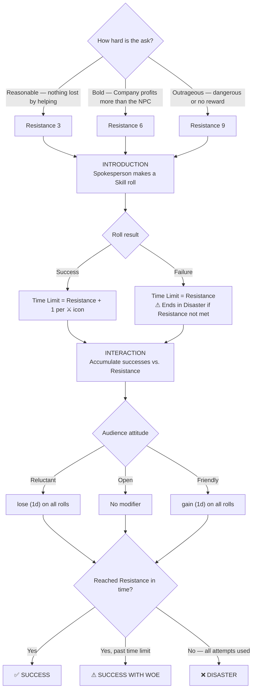

> [!tip] See also
> [[Rules]] · [[TOR Cheat Sheet]]
> PDF: [[TOR_Core_Rules.pdf#page=108|Core Rules p.104]]

A Council is a **formal social gathering** where the stakes are high and the Company stands to win or lose something of value. Not every conversation is a council — only use these rules when the outcome truly matters and the Company has a declared goal.

---

## What Makes a Council?

- A **formal gathering** with one or more important NPCs
- The **Company has a clear objective** before it begins
- Success or failure has **meaningful consequences**

> [!warning] Not a council
> Casual chats, rumour-gathering, and minor social exchanges use standard Skill rolls — no council rules needed.

---

## Council Sequence

---

## Step 1 — Set Resistance

The Resistance rating measures how hard the Company's goal is to achieve.

| Rating | Type | When it applies |
|---|---|---|
| **3** | Reasonable | NPC loses nothing by helping; Company offers something in return |
| **6** | Bold | Company profits more than the NPC |
| **9** | Outrageous | Ask is dangerous, or has little/no reward for the NPC |

---

## Step 2 — Introduction

The Company elects a **spokesperson**. That hero makes a Skill roll. The result sets the **time limit** — the total number of Interaction attempts the Company gets before being dismissed.

- **Success:** Time Limit = Resistance + 1 per ⚔ icon rolled
- **Failure:** Time Limit = Resistance exactly. If Resistance is never reached, the council ends in a **Disaster** (not just failure)

### Useful Introduction Skills

| Skill | Use |
|---|---|
| **Awe** | Impress strangers, overturn a hostile reaction, quickly set the terms |
| **Courtesy** | Smooth the relationship, especially when already on friendly terms; avoids revealing too much |
| **Riddle** | Extract information while revealing little; risks provoking mistrust if poorly done |

---

## Step 3 — Interaction

The Company makes Skill rolls to accumulate successes. Each rolled ⚔ icon counts as an additional success (not just a degree of success — it directly adds to the running total).

Players choose their own approach; the LM determines whether the audience is **Reluctant, Open, or Friendly**.

| Attitude | Modifier |
|---|---|
| **Reluctant** | lose (1d) — the NPC is unwilling or prejudiced |
| **Open** | no modifier — default attitude |
| **Friendly** | gain (1d) — the NPC wants to hear the Company out |

> [!tip] Good Roleplaying Matters
> If a speech touches topics genuinely important to the audience and the Company's goal, the LM can grant gain (1d) or even (2d) on that Skill roll.

### Useful Interaction Skills

| Skill | Use |
|---|---|
| **Enhearten** | Raise spirits of a community or downcast leader — requires an audience or single focused listener |
| **Insight** | Evaluate emotions, reveal hidden purposes or unspoken feelings |
| **Persuade** | Win minds or strengthen an already-positive hold; can be used discreetly |
| **Riddle** | Gather information, let incautious speakers reveal tidbits; appears uninterested |
| **Song** | Diplomacy through performance at a social gathering |

---

## End of a Council

[[TOR_Core_Rules.pdf#page=112|Core Rules p.108]]

| Outcome | Condition | Result |
|---|---|---|
| **Success** | Resistance met in time | Company achieves its stated objective |
| **Success with Woe** | Resistance met, but past the time limit | Goal achieved at a price — less than asked for, or a new enemy made |
| **Disaster** | All attempts used without reaching Resistance **or** failed Introduction leads to a botched council | Company is seen as a threat — risk of imprisonment or attack |
