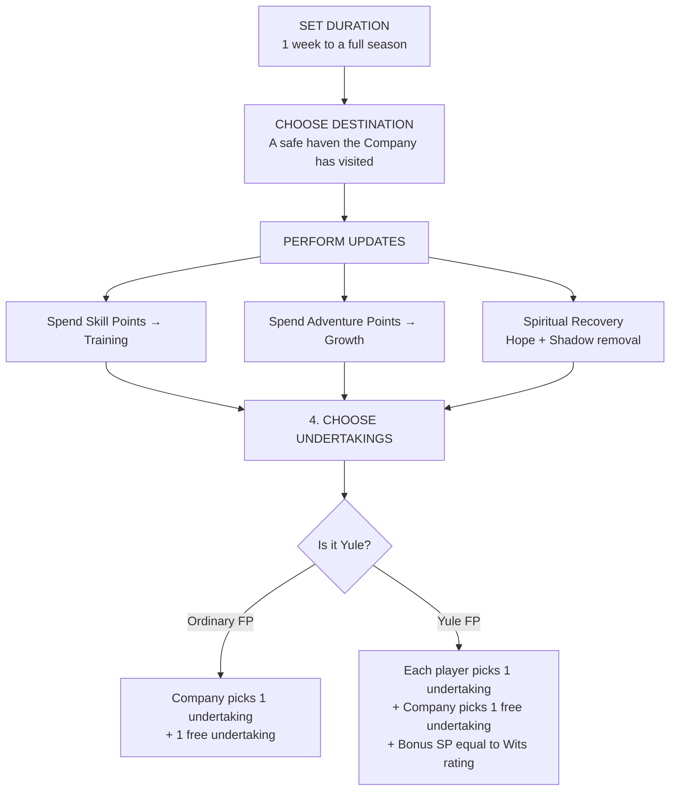

> [!tip] See also
> [[Rules]] · [[TOR Cheat Sheet]]
> PDF: [[TOR_Core_Rules.pdf#page=122|Core Rules p.118]]

The Fellowship Phase is the **player-driven downtime** between Adventuring Phases. The LM steps back. Heroes rest, grow, and pursue personal ambitions. It marks the conclusion of each Adventuring Phase, ideally played at the end of a gaming session.

---

## Fellowship Phase Structure

---

## 1. Set Duration

A Fellowship Phase lasts at least **1 week**, up to an entire season. The longest is Yule — the entire winter cold season (≈ once every 3 Fellowship Phases).

---

## 2. Choose Destination

Must be a **safe haven** the Company has already visited. Players cannot introduce new locations during a Fellowship Phase. Ideal havens: **Bree** (The Prancing Pony) and **Rivendell**.

> The journey to the chosen destination is handled 'behind the scenes' unless the players want to play it out.

---

## 3. Perform Updates

### Training — Skill Points (SP)

Spend SP to raise Skill ratings.

| New Skill Level | SP Cost |
|---|---|
| 1 pip | 4 |
| 2 pips | 8 |
| 3 pips | 12 |
| 4 pips | 20 |
| 5 pips | 26 |
| 6 pips | 30 |

> Maximum **1 rank per Skill per Fellowship Phase**. Unspent SP carry over.

### Growth — Adventure Points (AP)

Spend AP to raise **Valour or Wisdom** rank, or Combat Proficiencies.

| New Valour/Wisdom Rank | New Combat Prof. Level | AP Cost |
|---|---|---|
| — | 1 pip | 4 |
| 2 | 2 pips | 8 |
| 3 | 3 pips | 12 |
| 4 | 4 pips | 20 |
| 5 | 5 pips | 26 |
| 6 | 6 pips | 30 |

> Maximum **1 rank each in Valour and Wisdom per FP** (but not both). Gaining a new rank grants a Reward (Valour) or Virtue (Wisdom).

### Spiritual Recovery

- Each hero automatically recovers **Hope equal to their Heart score**
- At **Yule**, all Hope is fully restored
- If the Adventuring Phase was a **positive outcome** against Shadow, heroes remove Shadow points:
  - Marginally interfered with Shadow's return → **remove 1 Shadow**
  - Actively hindered or damaged the Enemy → **remove up to 2 Shadow**
  - Committed feats that would gain the Dark Lord's attention → **remove up to 3 Shadow**

---

## 4. Choose Undertakings

[[TOR_Core_Rules.pdf#page=125|Core Rules p.121]]

| Phase Type | Undertakings Available |
|---|---|
| Ordinary Fellowship Phase | Company picks **1 undertaking** + **1 free** (based on Callings) |
| Yule Fellowship Phase | Each player picks **1 undertaking** + Company picks **1 free** (based on Callings) |

Players must always select **different** undertakings unless an activity is marked Yule-only.

### All Undertakings

| Undertaking | Effect | Free for |
|---|---|---|
| **Gather Rumours** | Receive a rumour from the LM about a person, place, or coming event | Wardens |
| **Meet Patron** | Visit a Patron for support (possibly accepting a task) | Messengers |
| **Ponder Storied and Figured Maps** | +1 to all Feat die rolls during Event Resolution until next FP | Scholars |
| **Strengthen Fellowship** | Raise Fellowship rating by +1 until next FP | Captains |
| **Study Magical Items** | Learn all properties of Marvellous Artefacts / Wondrous Items held | Treasure Hunters |
| **Write a Song** | Compose a Lay, Song of Victory, or Walking-song for use in play | Champions |
| **Heal Scars** *(Yule only)* | Spend 5 AP → remove 1 Shadow Scar | — |
| **Raise an Heir** *(Yule only)* | Spend up to 5 Treasure + equal AP → add to heir's Previous Experience | — |
| **Recount a Story** *(Yule only)* | Replace one Distinctive Feature with a trait displayed in the story | — |

---

## Songs (Written during Undertakings)

Each song may be used **once per Adventuring Phase**. Mark it off whether used successfully or not.

| Song Type | Used During | Effect |
|---|---|---|
| **Lay** | Councils | Ignore effects of being Weary for the length of the venture |
| **Song of Victory** | Combat | Ignore Weary (singing is a secondary action) |
| **Walking-song** | Journeys | Ignore Weary |

To sing: choose an appropriate song from the Company's list, then make a **Song roll**. Heroes who succeed ignore Weary for the venture.

---

## Yule — The Passage of the Years

Yule occurs approximately **once every three Fellowship Phases**. The Company disbands temporarily; everyone returns home for winter.

- Each hero earns **bonus SP = their Wits rating** (added to the normal session total)
- The LM updates the Company on changes in the world
- All Yule-only undertakings become available
