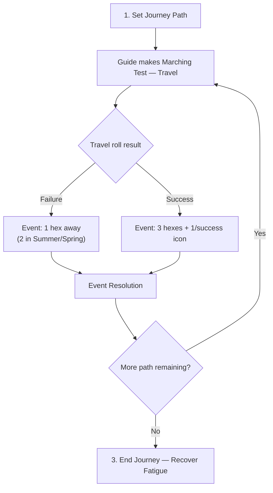
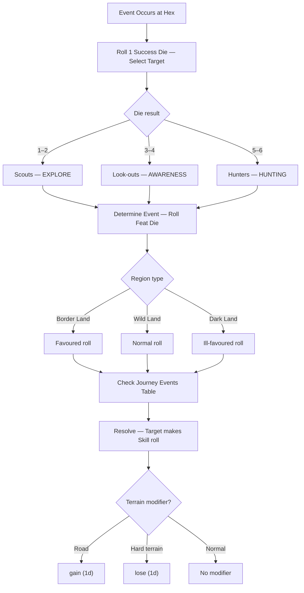

> [!tip] See also
> [[Rules]] · [[TOR Cheat Sheet]] · [[Strider Mode]]
> PDF: [[TOR_Core_Rules.pdf#page=112|Core Rules p.108]]

A Journey is more than travel — it's a dangerous, meaningful part of each Adventuring Phase, tracked on a Journey Log sheet. Use these rules whenever the Company travels to a new destination across unfamiliar or dangerous land.

> [!warning] Strider Mode Difference
> In solo play, there are **no journey roles**. Use the Solo Journey Events table directly. The Guide still makes Marching Tests with **Travel**. See [[Strider Mode]].

---

## Journey Sequence

---

## 1. Set Journey Path

- Players mark their route on the map. Path cannot be 'as the crow flies' — follow terrain.
- Loremaster traces path on journey log hex grid.
- Long journeys (20+ hexes) should be split into **legs** treated as separate journeys.
- Note any **Perilous Areas** on the route (see below).

---

## Assign Journey Roles

| Role | Function | Skill Tested |
|---|---|---|
| **Guide** | Route, rest, supplies. Only one allowed. | Travel (Marching Test) |
| **Hunter** | Find food in the wild | Hunting |
| **Look-out** | Keep watch | Awareness |
| **Scout** | Set up camp, open trails | Explore |

If fewer than 4 heroes, one hero covers multiple roles (but only one Guide). If more than 4, extras can double up on any role except Guide.

---

## 2. Make Marching Tests

The **Guide** rolls **Travel** each time a new event spot needs to be placed.

- **Failure:** Event occurs 2 hexes away (Summer/Spring) or **1 hex away** (Autumn/Winter)
- **Success:** Event occurs **3 hexes away, +1 per success icon (⚔)**

Once an event is resolved, the Guide makes another Marching Test for the next event, and so on until the destination is reached.

---

## Event Resolution

### Journey Events Table

[[TOR_Core_Rules.pdf#page=116|Core Rules p.112]]

| Feat Die | Event | Fail Result | Success Result | Fatigue |
|---|---|---|---|---|
| :TrEye: | **Terrible Misfortune** | Target is **Wounded** | — | 3 |
| 1 | **Despair** | Everyone gains 1 Shadow (Dread) | — | 2 |
| 2–3 | **Ill Choices** | Target gains 1 Shadow (Dread) | — | 2 |
| 4–7 | **Mishap** | +1 day to journey; target +1 Fatigue | — | 2 |
| 8–9 | **Short Cut** | — | Journey –1 day | 1 |
| 10 | **Chance-meeting** | — | No Fatigue gained; favourable encounter | 1 |
| :TrGandalf: | **Joyful Sight** | — | Everyone regains 1 Hope | — |

> [!Rolls] Event Descriptions (quick reference)
> - **Terrible Misfortune** — prey too dangerous, fell from lookout post, extreme cold
> - **Despair** — blighted area, grim remains, chill presence of Shadow
> - **Ill Choices** — wrong path, lost sleep, worried the group
> - **Mishap** — adversity slows the Company (no food, wrong gear, difficult terrain)
> - **Short Cut** — quick path found, efficient hunt, keen lookout
> - **Chance-meeting** — friendly traveller, useful directions, possibly a Patron
> - **Joyful Sight** — Wandering Elves, a holy glade, a benevolent spirit

---

## 3. Ending the Journey

Journey ends when the Guide's Marching Test result matches or exceeds the hexes remaining to the destination.

### Travel Fatigue

All heroes accumulate Fatigue during a journey. At journey's end:

1. **Mounts first:** Reduce total Fatigue by the mount's **Vigour** rating
2. **Travel roll:** Each hero may roll Travel — success reduces Fatigue by 1, +1 per success icon

Any remaining Fatigue stays until the hero takes a **Prolonged Rest** in a sheltered safe refuge (not 'on the road').

### Journey Length (in days)

Count hexes in the Company's path. Add 1 day per hex of **hard terrain** (hills, woods, marshes). Halve the total (round up) if travelling entirely on horseback via roads.

**Forced March:** Count 1 day per 2 hexes, but each hero gains +1 Fatigue per day of forced march.

---

## Perilous Locations

Some map areas are marked as Perilous with a **Peril rating**.

1. Company stops as soon as it enters the Perilous Area
2. Face a number of Events equal to the Peril rating (normal rules apply)
3. Then continue the journey from the first hex outside the area
